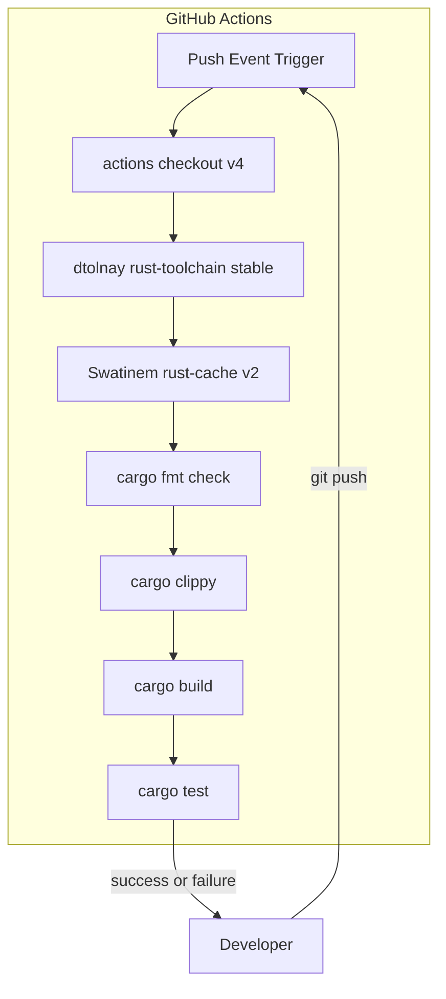
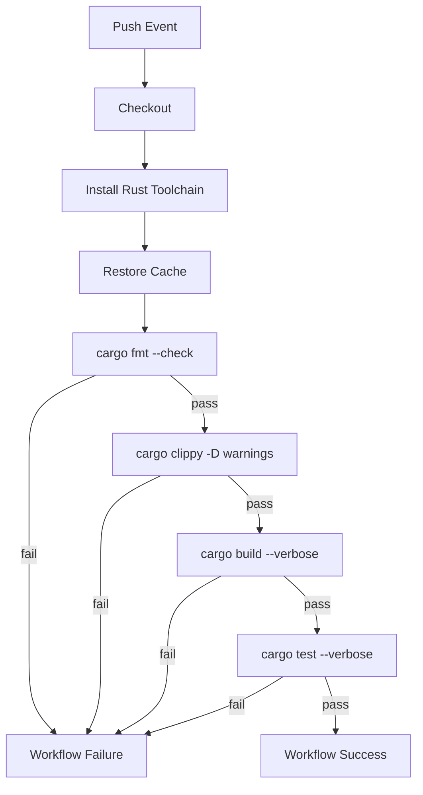

# Design Document

## Overview
**Purpose**: GitHub Actionsワークフローを導入し、pushイベント時にRustプロジェクトのビルド・テスト・コード品質チェックを自動実行する。

**Users**: hyetograph-cliの開発者が、コードをpushするたびにリグレッションやコード品質の劣化を自動検出するために利用する。

**Impact**: 現在CIが未構成の状態から、`.github/workflows/`に単一のワークフローファイルを追加することで、継続的インテグレーションを実現する。

### Goals
- pushイベントで`cargo test`によるユニットテスト・統合テストの自動実行
- `cargo fmt --check`と`cargo clippy`によるコード品質の自動検証
- Cargoキャッシュによるビルド時間の短縮

### Non-Goals
- Pull Requestトリガーの設定（今回のスコープはpushのみ）
- クロスプラットフォームビルド（Linux単一環境で十分）
- デプロイメントやリリース自動化
- コードカバレッジレポート

## Architecture

### Architecture Pattern & Boundary Map

**Architecture Integration**:
- Selected pattern: 単一ジョブ・順次ステップ実行。小規模プロジェクトに適したシンプルな構成
- Domain boundaries: GitHub Actionsワークフロー定義（YAML）が唯一の新規成果物。既存ソースコードへの変更なし
- Existing patterns preserved: `cargo test`によるテスト実行パターンを維持（ユニットテスト + `tests/e2e.rs`統合テスト）
- Steering compliance: Rustプロジェクトの開発規約（stable toolchain、`cargo test`）に準拠

### Technology Stack

| Layer | Choice / Version | Role in Feature | Notes |
|-------|------------------|-----------------|-------|
| CI Platform | GitHub Actions | ワークフロー実行基盤 | リポジトリ統合済み |
| Runner | `ubuntu-latest` | ビルド・テスト実行環境 | Rust公式サポート |
| Toolchain Setup | `dtolnay/rust-toolchain@stable` | Rust stable + rustfmt + clippy構成 | `actions-rs`非推奨の後継 |
| Cache | `Swatinem/rust-cache@v2` | Cargo依存関係キャッシュ | デフォルト設定で十分 |
| Checkout | `actions/checkout@v4` | ソースコード取得 | 標準Action |

## System Flows

実行順序はフォーマット → lint → ビルド → テストとし、最もコストの低いチェックを先に実行して早期失敗を実現する。

## Requirements Traceability

| Requirement | Summary | Components | Flows |
|-------------|---------|------------|-------|
| 1.1 | pushで`cargo test`実行 | CIワークフロー / Testステップ | Test実行フロー |
| 1.2 | 全パスでsuccess | CIワークフロー | Success終了パス |
| 1.3 | 失敗でfailure+ログ | CIワークフロー | Failure終了パス |
| 2.1 | stable toolchain使用 | CIワークフロー / Toolchainステップ | Toolchainセットアップ |
| 2.2 | Cargoキャッシュ活用 | CIワークフロー / Cacheステップ | Cache復元フロー |
| 3.1 | テスト前にbuild実行 | CIワークフロー / Buildステップ | Build検証フロー |
| 3.2 | build失敗でfailure | CIワークフロー / Buildステップ | Failure終了パス |
| 4.1 | `cargo fmt --check`実行 | CIワークフロー / Fmtステップ | フォーマットチェックフロー |
| 4.2 | `cargo clippy -D warnings`実行 | CIワークフロー / Clippyステップ | Lintチェックフロー |
| 4.3 | fmt/clippy違反でfailure | CIワークフロー / Fmt・Clippyステップ | Failure終了パス |

## Components and Interfaces

| Component | Domain/Layer | Intent | Req Coverage | Key Dependencies | Contracts |
|-----------|--------------|--------|--------------|------------------|-----------|
| CI Workflow | Infrastructure | push時の自動テスト・品質チェック | 1.1-4.3 | GitHub Actions (P0) | Batch |

### Infrastructure

#### CI Workflow (`ci.yml`)

| Field | Detail |
|-------|--------|
| Intent | pushイベントで品質チェック・ビルド・テストを順次実行する |
| Requirements | 1.1, 1.2, 1.3, 2.1, 2.2, 3.1, 3.2, 4.1, 4.2, 4.3 |

**Responsibilities & Constraints**
- pushイベントのトリガー検出とワークフロー起動
- Rust toolchain（stable + rustfmt + clippy）のセットアップ
- Cargoキャッシュの復元・保存
- フォーマット・lint・ビルド・テストの順次実行と結果報告
- 各ステップの失敗時にワークフロー全体をfailureとする（GitHub Actionsのデフォルト動作）

**Dependencies**
- External: `actions/checkout@v4` — ソースコード取得 (P0)
- External: `dtolnay/rust-toolchain@stable` — Rust toolchain構成 (P0)
- External: `Swatinem/rust-cache@v2` — Cargo依存キャッシュ (P1)

**Contracts**: Batch [x]

##### Batch / Job Contract
- **Trigger**: リポジトリへのpushイベント
- **Input / Validation**: チェックアウト済みソースコード。Cargo.tomlとCargo.lockの存在が前提
- **Output**: ワークフローのsuccess/failureステータス。各ステップのログ出力
- **Idempotency & Recovery**: 各push は独立したワークフロー実行。失敗時は修正コードの再pushで再実行

**Implementation Notes**
- ファイル配置: `.github/workflows/ci.yml`
- 環境変数`CARGO_TERM_COLOR: always`でカラー出力を有効化
- `--verbose`フラグでデバッグ情報の充実化
- `cargo clippy`には`--all-targets --all-features`を付与し、テストコード含む全ターゲットを検査

## Testing Strategy

### Workflow検証
- ワークフローファイルをpushし、GitHub Actionsのログでステップ実行を確認
- 意図的にテスト失敗を含むコミットをpushし、failure検出を確認
- フォーマット違反のコードをpushし、`cargo fmt --check`での検出を確認
- clippy警告を含むコードをpushし、failure検出を確認

### 検証項目
- `cargo test`でユニットテスト（各モジュール内`#[cfg(test)]`）と統合テスト（`tests/e2e.rs`）が実行されること
- キャッシュの復元が機能し、2回目以降のビルド時間が短縮されること
- ワークフローのsuccessステータスがGitHubのUIに反映されること
