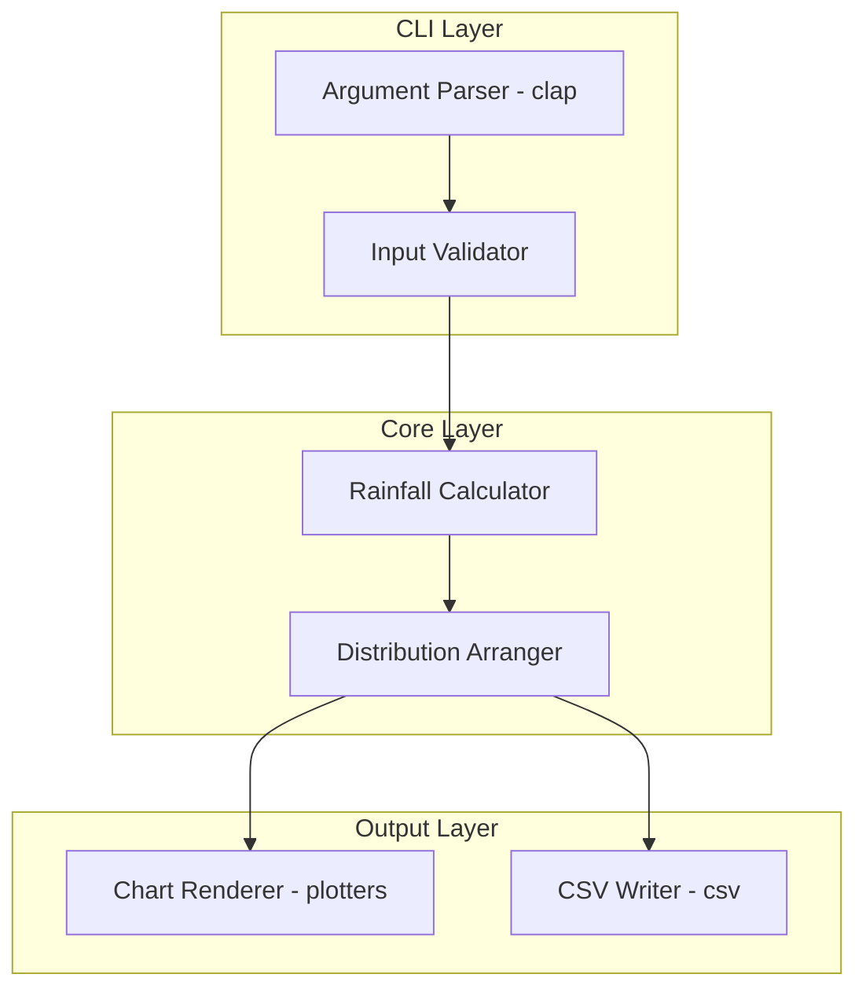
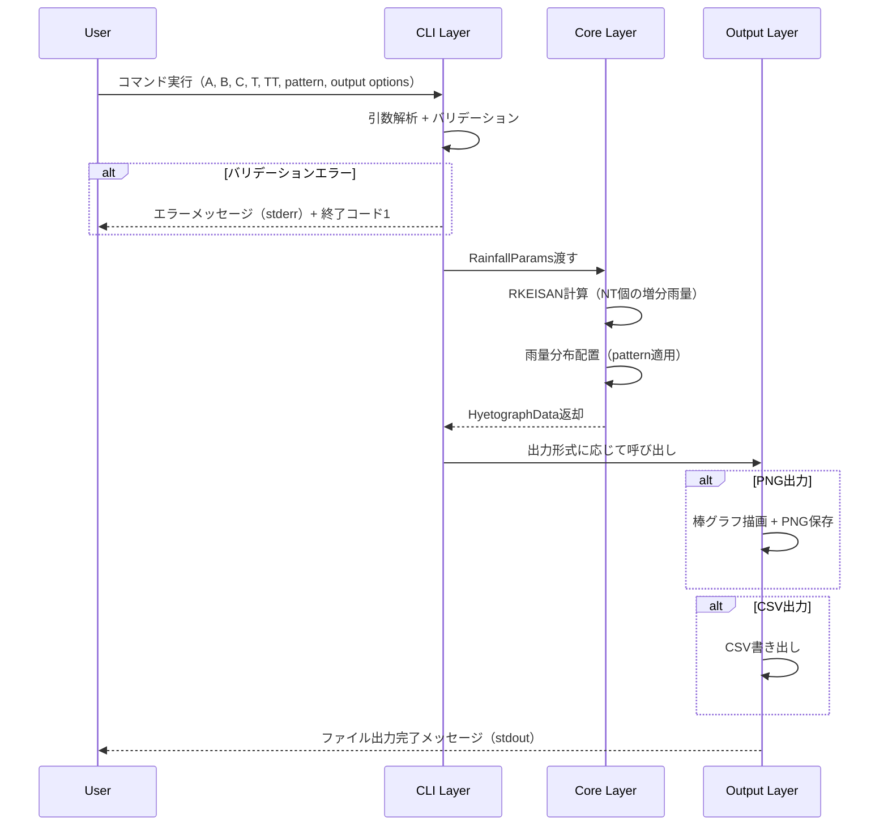
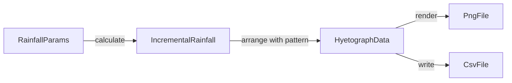

# Design Document: hyetograph-cli

## Overview
**Purpose**: 降雨強度式のパラメータから交互ブロック法に基づくハイエトグラフを生成し、PNG棒グラフおよびCSVデータとして出力するRust製CLIツール。既存のExcel VBAマクロ（RKEISAN + 雨量分布配置）と同一の計算結果を再現する。

**Users**: 河川技術者が設計降雨の時間分布作成・報告書作成に利用する。

### Goals
- VBAのRKEISANサブルーチンと数値的に同一の増分雨量を算出する
- 3種の雨量分布パターン（前方集中・中央集中・後方集中）をサポートする
- PNG棒グラフおよびCSVファイルとして出力する
- 直感的なCLIインターフェースを提供する

### Non-Goals
- GUI（グラフィカルユーザーインターフェース）の提供
- 観測データ（CSVファイル）からのハイエトグラフ生成（将来拡張候補）
- SVG・PDF等のPNG以外の画像出力形式
- 日本語フォントのバンドル

## Architecture

### Architecture Pattern & Boundary Map



**Architecture Integration**:
- Selected pattern: Layered（3層構成）— CLIツールの単一目的に最適なサイズ。詳細は`research.md`を参照
- Domain boundaries: CLI層（入力解析・バリデーション）→ Core層（計算ロジック）→ Output層（出力生成）の一方向依存
- New components rationale: 全コンポーネントが新規。各層の責務を明確に分離し、Core層を単体テスト可能にする

### Technology Stack

| Layer | Choice / Version | Role in Feature | Notes |
|-------|------------------|-----------------|-------|
| CLI | clap v4.5 (derive feature) | 引数解析、ヘルプ/バージョン表示 | ValueEnumで雨量分布パターンを定義 |
| Core | Rust std (f64) | 降雨強度計算、雨量分布配置 | 外部依存なし |
| Output - Chart | plotters (latest) | PNG棒グラフ描画 | BitMapBackendを使用 |
| Output - CSV | csv + serde | CSV出力 | Serdeでの構造体シリアライズ |
| Error Handling | anyhow | アプリケーションエラーチェイン | CLIツールとして簡潔なエラー報告 |

## System Flows

### メイン処理フロー



## Requirements Traceability

| Requirement | Summary | Components | Interfaces | Flows |
|-------------|---------|------------|------------|-------|
| 1.1 | 降雨強度式による増分雨量計算 | RainfallCalculator | calculate | メイン処理 |
| 1.2 | 増分雨量の降順保持 | RainfallCalculator | calculate | メイン処理 |
| 1.3 | VBA同一数値結果 | RainfallCalculator | calculate | メイン処理 |
| 2.1 | 前方集中型配置 | DistributionArranger | arrange | メイン処理 |
| 2.2 | 中央集中型配置 | DistributionArranger | arrange | メイン処理 |
| 2.3 | 後方集中型配置 | DistributionArranger | arrange | メイン処理 |
| 2.4 | デフォルト中央集中型 | CLI Args | default_value | メイン処理 |
| 3.1 | PNG棒グラフ出力 | ChartRenderer | render | メイン処理 |
| 3.2 | 軸ラベル表示 | ChartRenderer | render | メイン処理 |
| 3.3 | 出力パス指定 | CLI Args, ChartRenderer | render | メイン処理 |
| 3.4 | デフォルトファイル名 | CLI Args | default_value | メイン処理 |
| 3.5 | タイトル・軸ラベル自動設定 | ChartRenderer | render | メイン処理 |
| 4.1 | CSV出力 | CsvWriter | write | メイン処理 |
| 4.2 | CSVヘッダー行 | CsvWriter | write | メイン処理 |
| 4.3 | PNG+CSV同時出力 | main | dispatch | メイン処理 |
| 5.1 | 必須引数（A,B,C,T,TT） | CLI Args | — | メイン処理 |
| 5.2 | オプション引数（pattern） | CLI Args | — | メイン処理 |
| 5.3 | 出力形式オプション | CLI Args | — | メイン処理 |
| 5.4 | --help | CLI Args (clap) | — | — |
| 5.5 | --version | CLI Args (clap) | — | — |
| 5.6 | 引数不足エラー | CLI Args (clap) | — | メイン処理 |
| 5.7 | 終了コード | main | process::exit | メイン処理 |
| 6.1 | パラメータ正値バリデーション | InputValidator | validate | メイン処理 |
| 6.2 | TT正値バリデーション | InputValidator | validate | メイン処理 |
| 6.3 | パターン範囲バリデーション | CLI Args (ValueEnum) | — | メイン処理 |
| 6.4 | NT整数バリデーション | InputValidator | validate | メイン処理 |
| 6.5 | 出力先ディレクトリ存在確認 | InputValidator | validate | メイン処理 |
| 6.6 | stderrへのエラー出力 | main (anyhow) | — | メイン処理 |

## Components and Interfaces

| Component | Domain/Layer | Intent | Req Coverage | Key Dependencies | Contracts |
|-----------|-------------|--------|--------------|------------------|-----------|
| CliArgs | CLI | 引数定義と解析 | 5.1-5.7, 2.4 | clap (P0) | State |
| InputValidator | CLI | 入力値のバリデーション | 6.1-6.6 | — | Service |
| RainfallCalculator | Core | RKEISAN相当の増分雨量計算 | 1.1-1.3 | — | Service |
| DistributionArranger | Core | 雨量分布配置 | 2.1-2.4 | — | Service |
| ChartRenderer | Output | PNG棒グラフ描画 | 3.1-3.5 | plotters (P0) | Service |
| CsvWriter | Output | CSVファイル出力 | 4.1-4.3 | csv, serde (P0) | Service |

### CLI Layer

#### CliArgs

| Field | Detail |
|-------|--------|
| Intent | clapのderive macroによるCLI引数の定義と解析 |
| Requirements | 5.1, 5.2, 5.3, 5.4, 5.5, 5.6, 5.7, 2.4 |

**Responsibilities & Constraints**
- 必須引数（A, B, C, T, TT）とオプション引数（pattern, output, format）の定義
- clapが提供する`--help`/`--version`/引数不足エラーの自動処理
- DistributionPatternをValueEnumで定義し、clapレベルでの値バリデーション

**Dependencies**
- External: clap v4.5 (derive feature) — CLI引数解析 (P0)

**Contracts**: State [x]

##### State Management

```rust
// CLI引数定義
struct Cli {
    // 降雨強度係数A（べき乗指数）
    a: f64,
    // 降雨強度係数B（加算定数）
    b: f64,
    // 降雨強度係数C（分子定数）
    c: f64,
    // 計算時間刻み[分]
    t: f64,
    // 降雨継続時間[時間]
    tt: f64,
    // 雨量分布パターン（デフォルト: Center）
    pattern: DistributionPattern,
    // 出力ファイルパス（デフォルト: hyetograph.png）
    output: PathBuf,
    // 出力形式
    format: OutputFormat,
}

enum DistributionPattern {
    Front,   // 前方集中型（パターン1）
    Center,  // 中央集中型（パターン2）
    Rear,    // 後方集中型（パターン3）
}

enum OutputFormat {
    Png,   // PNGのみ
    Csv,   // CSVのみ
    Both,  // PNG + CSV
}
```

#### InputValidator

| Field | Detail |
|-------|--------|
| Intent | CLI引数のドメインバリデーション |
| Requirements | 6.1, 6.2, 6.3, 6.4, 6.5, 6.6 |

**Responsibilities & Constraints**
- A, B, C, Tが正値であることの検証
- TTが正値であることの検証
- `TT * 60 / T`が整数になることの検証
- 出力先ディレクトリの存在確認

**Dependencies**
- Inbound: CliArgs — バリデーション対象 (P0)

**Contracts**: Service [x]

##### Service Interface
```rust
// バリデーション実行
// 入力: Cli引数
// 出力: Ok(ValidatedParams) | Err(エラーメッセージ)
fn validate(cli: &Cli) -> Result<ValidatedParams>

struct ValidatedParams {
    rainfall_params: RainfallParams,
    pattern: DistributionPattern,
    output_config: OutputConfig,
}
```
- Preconditions: Cli構造体が正常に解析済み
- Postconditions: すべてのドメインルールを満たすValidatedParamsを返す、またはstderrにエラー出力

### Core Layer

#### RainfallCalculator

| Field | Detail |
|-------|--------|
| Intent | VBA RKEISAN相当の降雨強度計算 |
| Requirements | 1.1, 1.2, 1.3 |

**Responsibilities & Constraints**
- 降雨強度式 `K = C / ((T * I)^A + B)` に基づく計算
- 増分雨量 `R(I) = K * I - ZK` の算出
- 演算順序をVBAと完全一致させ、f64精度でのビット一致を目指す
- 外部依存なし（Pure Rust std）

**Dependencies**
- Inbound: InputValidator — RainfallParams提供 (P0)
- Outbound: DistributionArranger — 増分雨量配列を提供 (P0)

**Contracts**: Service [x]

##### Service Interface
```rust
struct RainfallParams {
    a: f64,   // べき乗指数
    b: f64,   // 加算定数
    c: f64,   // 分子定数
    t: f64,   // 計算時間刻み[分]
    tt: f64,  // 降雨継続時間[時間]
}

// 増分雨量の計算
// 入力: RainfallParams
// 出力: Vec<f64> — NT個の増分雨量（R[0]が最大、降順）
fn calculate(params: &RainfallParams) -> Vec<f64>
```
- Preconditions: パラメータはバリデーション済み（全正値、NT整数）
- Postconditions: 返却配列の長さ == NT、各要素 >= 0、VBAと同一の数値結果
- Invariants: 計算は純粋関数（副作用なし）

#### DistributionArranger

| Field | Detail |
|-------|--------|
| Intent | 増分雨量の時間軸配置 |
| Requirements | 2.1, 2.2, 2.3, 2.4 |

**Responsibilities & Constraints**
- 3種のパターンに応じた配置ロジック
- 前方集中: R(I)を先頭から順に配置
- 中央集中: 奇数番目を中央→後方、偶数番目を中央→前方（VBA Case 2と同一）
- 後方集中: R(I)を末尾から順に配置

**Dependencies**
- Inbound: RainfallCalculator — 増分雨量配列 (P0)
- Outbound: ChartRenderer, CsvWriter — HyetographDataを提供 (P0)

**Contracts**: Service [x]

##### Service Interface
```rust
struct HyetographEntry {
    time_minutes: f64,  // 経過時間[分]（T * index）
    intensity: f64,     // 降雨強度[mm/h]
}

// 雨量分布配置
// 入力: 増分雨量配列、パターン、時間刻みT
// 出力: 時系列順に並んだHyetographEntry配列
fn arrange(
    increments: &[f64],
    pattern: DistributionPattern,
    t: f64,
) -> Vec<HyetographEntry>
```
- Preconditions: incrementsは空でない、tは正値
- Postconditions: 返却配列の長さ == increments.len()、time_minutesは昇順
- Invariants: 入力の増分雨量の総和 == 出力の強度の総和（保存則）

### Output Layer

#### ChartRenderer

| Field | Detail |
|-------|--------|
| Intent | ハイエトグラフのPNG棒グラフ描画 |
| Requirements | 3.1, 3.2, 3.3, 3.4, 3.5 |

**Responsibilities & Constraints**
- plottersのBitMapBackendでPNG出力
- 横軸: 経過時間、縦軸: 降雨強度(mm/h)
- 棒グラフの各バーは時間刻み幅
- タイトル・軸ラベルの自動設定

**Dependencies**
- Inbound: DistributionArranger — HyetographEntry配列 (P0)
- External: plotters — PNG描画 (P0)

**Contracts**: Service [x]

##### Service Interface
```rust
struct ChartConfig {
    output_path: PathBuf,
    width: u32,   // デフォルト: 800
    height: u32,  // デフォルト: 600
}

// チャート描画
// 入力: ハイエトグラフデータ、設定
// 出力: Ok(()) ファイル出力完了 | Err(出力エラー)
fn render(
    data: &[HyetographEntry],
    config: &ChartConfig,
) -> Result<()>
```
- Preconditions: dataは空でない、output_pathの親ディレクトリが存在する
- Postconditions: 指定パスにPNGファイルが生成される

#### CsvWriter

| Field | Detail |
|-------|--------|
| Intent | ハイエトグラフ数値データのCSV出力 |
| Requirements | 4.1, 4.2, 4.3 |

**Responsibilities & Constraints**
- ヘッダー行: `time_minutes,intensity_mm_per_h`
- 各行: 経過時間[分], 降雨強度[mm/h]

**Dependencies**
- Inbound: DistributionArranger — HyetographEntry配列 (P0)
- External: csv + serde — CSVシリアライズ (P0)

**Contracts**: Service [x]

##### Service Interface
```rust
// CSV出力
// 入力: ハイエトグラフデータ、出力パス
// 出力: Ok(()) ファイル出力完了 | Err(出力エラー)
fn write(
    data: &[HyetographEntry],
    output_path: &Path,
) -> Result<()>
```
- Preconditions: dataは空でない、output_pathの親ディレクトリが存在する
- Postconditions: 指定パスにCSVファイルが生成される（ヘッダー行 + データ行）

## Data Models

### Domain Model



- **RainfallParams**: 入力パラメータ（A, B, C, T, TT）の値オブジェクト
- **IncrementalRainfall**: RKEISAN計算結果のVec<f64>（降順の増分雨量）
- **HyetographData**: 時系列順のVec<HyetographEntry>（最終出力データ）

### Logical Data Model

**HyetographEntry**:
- `time_minutes: f64` — 経過時間（分単位、T刻み）
- `intensity: f64` — 降雨強度（mm/h）

**Consistency**:
- time_minutesは `T, 2T, 3T, ..., NT*T` の等差数列
- intensity合計は降雨強度式から導出される総雨量と一致

## Error Handling

### Error Strategy
- `anyhow::Result`を全関数の戻り値に使用
- バリデーションエラーはearly returnでstderrに出力後、終了コード1で終了
- ファイルI/Oエラーはanyhowのcontextで具体的なパス情報を付加

### Error Categories and Responses

| Category | Trigger | Response | Exit Code |
|----------|---------|----------|-----------|
| バリデーションエラー | A,B,C,T <= 0 | パラメータ名と有効範囲を表示 | 1 |
| バリデーションエラー | TT <= 0 | エラーメッセージ表示 | 1 |
| バリデーションエラー | TT*60/T非整数 | 組み合わせ不適切メッセージ | 1 |
| バリデーションエラー | pattern範囲外 | clapが自動検出（ValueEnum） | 2 |
| I/Oエラー | 出力先不在 | ディレクトリパスを含むエラー | 1 |
| I/Oエラー | 書き込み失敗 | コンテキスト付きエラー | 1 |

## Testing Strategy

### Unit Tests
- `RainfallCalculator::calculate` — VBAとの数値一致検証（既知パラメータで検算）
- `DistributionArranger::arrange` — 3パターンそれぞれの配置正確性
- `InputValidator::validate` — 正常値/異常値の境界値テスト
- 増分雨量の総和保存テスト

### Integration Tests
- CLI引数→計算→CSV出力のエンドツーエンド検証
- CLI引数→計算→PNG出力のファイル生成確認
- 不正引数時のエラーメッセージとexit code検証
- `--help`/`--version`出力の確認

### VBA互換性テスト
- VBAでの既知の計算結果とRust実装の出力を比較
- 複数パラメータセットでの回帰テスト
